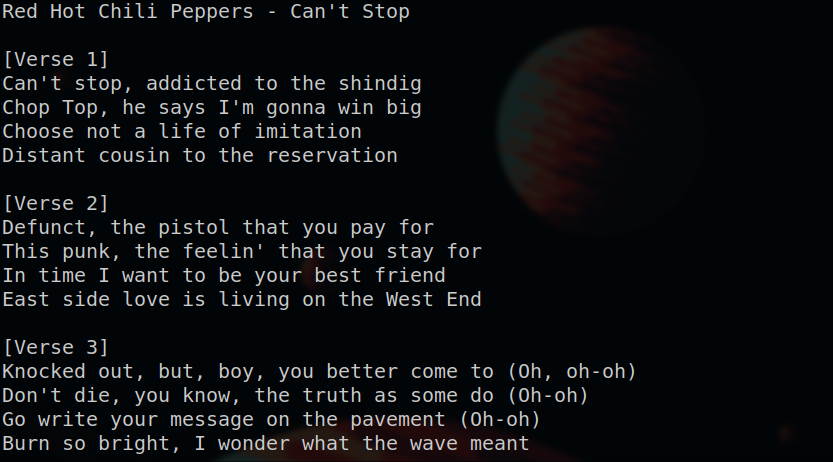

# tulyp

`tulyp` displays the lyrics of the currently playing song in the terminal.
It checks for lyrics from 3 sources (stops at the first successful result):

* genius.com
* google.com
* azlyrics.com

Tulyp only works with music players which are compliant with the [mpris](https://wiki.archlinux.org/title/MPRIS) specification (e.g. Spotify, ncspot).
You can specify the player to use as a commandline argument: `tulyp spotify`.
If no player is provided ncspot will be used.

Lyrics will be displayed in a curses window and you can use the arrow keys or j/k to scroll up and down.

Lyrics get saved under `~/.cache/lyrics/artist-title`.
If there are cached lyrics for a song, no queries will be executed.

Tulyp continously checks what song is currently playing and automatically reloads itself, to show the appropriate lyrics.
You can switch between lyrics sources with number keys:

* 1 - genius
* 2 - google
* 3 - azlyrics

## Dependencies (they will be installed with `tulyp`)

* `lyricsgenius` provides API to get lyrics from genius.com
* `dbus-python` to get the currently playing song through dbus
* `requests` to search for lyrincs on google
* `beautifulsoup4` to extract lyrics from html

## Install

`pip install tulyp`

## Naming

* we got a terminal user interface -> tu
* we are dealing with lyrics       -> ly
* the program is written in python -> p

I am so good at naming things.
